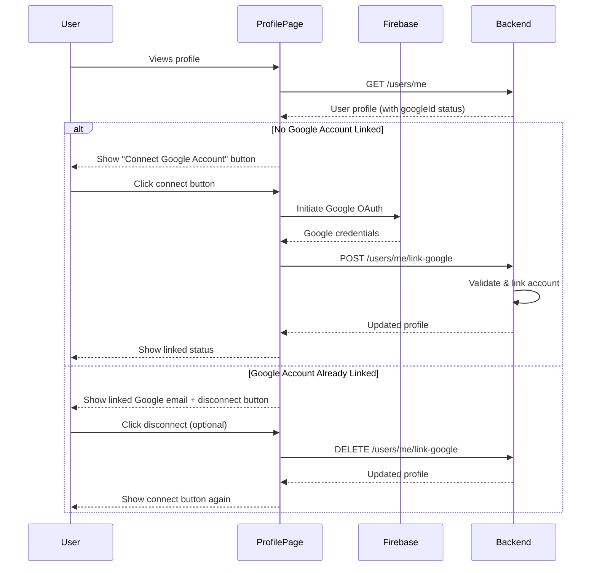

# Design Document

## Overview

This feature adds Google account linking functionality to user profiles, allowing users who created accounts with email/password to connect their Google account. This provides authentication flexibility and improves user experience by enabling sign-in through either method.

The implementation extends the existing Google OAuth integration to support account linking scenarios, adds UI components to the profile page for managing Google connections, and ensures proper validation to prevent duplicate account issues.

## Architecture

### High-Level Flow



### Component Architecture

1. **Frontend Components**
   - Profile page with Google account status display
   - Connect/disconnect button components
   - Confirmation modal for disconnection
   - Error handling and user feedback

2. **Backend Services**
   - Account linking endpoint
   - Account unlinking endpoint
   - Validation logic for duplicate prevention
   - User model updates

3. **Authentication Flow**
   - Firebase OAuth integration (reuse existing)
   - Token validation
   - Account association logic

## Components and Interfaces

### Frontend Components

#### GoogleAccountSection Component
```typescript
interface GoogleAccountSectionProps {
  googleId?: string;
  googleEmail?: string;
  onLink: () => Promise<void>;
  onUnlink: () => Promise<void>;
  canUnlink: boolean; // false if account was created via Google and has no password
}
```

This component displays:
- Current Google account status
- Connect button (if not linked)
- Linked email and disconnect button (if linked)
- Warning message (if disconnect is not allowed)

### Backend API Endpoints

#### Link Google Account
```
POST /users/me/link-google
Authorization: Bearer <firebase-token>
Body: {
  googleIdToken: string
}
Response: {
  user: UserProfile
}
```

#### Unlink Google Account
```
DELETE /users/me/link-google
Authorization: Bearer <firebase-token>
Response: {
  user: UserProfile
}
```

### Data Models

#### User Model Updates
The existing User model already has the necessary fields:
- `googleId`: string (optional) - stores the Google user ID
- `authProviders`: array of 'email' | 'google' - tracks authentication methods

We'll utilize these existing fields for the linking functionality.

#### UserProfile Interface Update
```typescript
export interface UserProfile {
  uid: string;
  email: string;
  displayName?: string;
  bio?: string;
  avatarUrl?: string;
  googleId?: string; // Add this field
  googleEmail?: string; // Add this field for display
  authProviders?: ('email' | 'google')[]; // Add this field
  preferences?: {
    theme?: 'light' | 'dark' | 'system';
    language?: string;
    notifications?: boolean;
  };
  createdAt: string;
  updatedAt?: string;
}
```


## Correctness Properties

*A property is a characteristic or behavior that should hold true across all valid executions of a system-essentially, a formal statement about what the system should do. Properties serve as the bridge between human-readable specifications and machine-verifiable correctness guarantees.*

### Property 1: Successful linking stores Google ID
*For any* user and valid Google OAuth token, when the link operation completes successfully, the user's profile should contain the Google user ID from the token.
**Validates: Requirements 1.3, 5.1**

### Property 2: Linked accounts display email
*For any* user with a googleId field populated, the profile page should display the associated Google email address.
**Validates: Requirements 2.1**

### Property 3: Disconnection removes Google ID
*For any* user with a linked Google account (googleId present), when disconnection is confirmed, the user's googleId field should be removed (set to null/undefined).
**Validates: Requirements 3.3**

### Property 4: Duplicate Google accounts are rejected
*For any* Google account already linked to a user, attempting to link that same Google account to a different user should fail with an error.
**Validates: Requirements 4.1**

### Property 5: Failed linking preserves state
*For any* user, when a Google account linking attempt fails (for any reason), the user's googleId field should remain unchanged from its pre-attempt value.
**Validates: Requirements 4.3**

### Property 6: Google sign-in authenticates to linked account
*For any* user with a linked Google account, signing in with that Google account should authenticate to the same user (matching uid).
**Validates: Requirements 5.2**

### Property 7: Email/password auth still works after linking
*For any* user who created an account with email/password and then linked a Google account, signing in with the original email/password should still authenticate successfully to the same account.
**Validates: Requirements 5.3**

## Error Handling

### Client-Side Errors

1. **OAuth Popup Blocked**
   - Display user-friendly message explaining popup was blocked
   - Provide instructions to allow popups

2. **OAuth Cancelled**
   - Handle gracefully without error notification
   - Return user to profile page in original state

3. **Network Errors**
   - Display retry option
   - Maintain current state

4. **Duplicate Account Error**
   - Display clear message: "This Google account is already linked to another user"
   - Suggest using different Google account or contacting support

### Server-Side Errors

1. **Invalid Token**
   - Return 401 Unauthorized
   - Error code: `INVALID_TOKEN`

2. **Google Account Already Linked**
   - Return 409 Conflict
   - Error code: `GOOGLE_ACCOUNT_IN_USE`
   - Include message explaining the Google account is already linked

3. **Cannot Disconnect (No Alternative Auth)**
   - Return 400 Bad Request
   - Error code: `CANNOT_DISCONNECT_ONLY_AUTH`
   - Include message explaining user must have password set before disconnecting

4. **User Not Found**
   - Return 404 Not Found
   - Error code: `USER_NOT_FOUND`

### Error Recovery

- All failed operations should be idempotent
- User state should remain consistent after any error
- Clear error messages should guide users to resolution

## Testing Strategy

### Unit Testing

We'll write unit tests for:
- Backend validation logic (duplicate checking, auth provider validation)
- API endpoint handlers (link, unlink)
- Error response formatting
- Component rendering based on different user states

### Property-Based Testing

We'll use property-based testing to verify:
- **Property 1**: Link operation stores Google ID correctly for all valid inputs
- **Property 2**: Profile display shows email for all users with googleId
- **Property 3**: Disconnect operation removes Google ID for all linked users
- **Property 4**: Duplicate detection works for all Google accounts
- **Property 5**: Failed operations preserve state for all users
- **Property 6**: Google sign-in routes to correct account for all linked users
- **Property 7**: Email/password auth works for all users after linking

For TypeScript/JavaScript, we'll use **fast-check** as the property-based testing library. Each property test will:
- Run a minimum of 100 iterations
- Generate random user states and inputs
- Verify the property holds across all generated cases
- Be tagged with comments referencing the design document property

Example property test structure:
```typescript
// Feature: google-account-linking, Property 1: Successful linking stores Google ID
it('should store Google ID for any valid link operation', () => {
  fc.assert(
    fc.property(
      fc.record({
        uid: fc.string(),
        email: fc.emailAddress(),
        googleToken: fc.string(),
      }),
      async (testData) => {
        // Test that linking stores the Google ID
        const result = await linkGoogleAccount(testData.uid, testData.googleToken);
        expect(result.googleId).toBeDefined();
      }
    ),
    { numRuns: 100 }
  );
});
```

### Integration Testing

Integration tests will verify:
- Complete OAuth flow from button click to profile update
- Backend API endpoints with real database operations
- Error handling across the full stack

### Edge Cases

Specific edge cases to test:
- User created via Google trying to disconnect (should be prevented if no password)
- Attempting to link an already-linked Google account
- Network failures during OAuth flow
- Token expiration during linking process

## Implementation Notes

### Security Considerations

1. **Token Validation**: Always validate Google ID tokens on the backend using Firebase Admin SDK
2. **Authorization**: Ensure users can only link/unlink their own accounts
3. **Audit Trail**: Log all account linking/unlinking operations for security monitoring

### Performance Considerations

1. **Database Queries**: Use indexed queries on googleId field for duplicate checking
2. **Caching**: Cache user profile data to minimize database calls
3. **Async Operations**: Handle OAuth flow asynchronously to prevent UI blocking

### Backward Compatibility

- Existing users without googleId will see the connect button
- Existing Google-only users will have googleId populated
- No migration needed as schema already supports these fields

## Dependencies

### Frontend
- Firebase Authentication (already integrated)
- Mantine UI components (already in use)
- fast-check (for property-based testing)

### Backend
- Firebase Admin SDK (already integrated)
- Mongoose (already in use)
- Express (already in use)

## Future Enhancements

1. **Multiple OAuth Providers**: Extend to support GitHub, Microsoft, etc.
2. **Account Merging**: Allow users to merge duplicate accounts
3. **Two-Factor Authentication**: Add 2FA options for enhanced security
4. **Auth Provider Management**: Dedicated settings page for managing all auth methods
